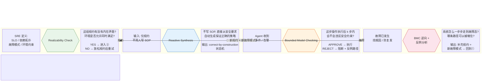

# Formal Verification Gate for OpenClaw SRE Agent

**TLA+ Model Checking meets LLM-powered SRE Automation**

[English](#overview) | [中文](#概述)

---

## Overview

This is an interactive demo that shows how **formal verification (TLA+ model checking)** can be integrated into an **LLM-based SRE Agent** (built on [OpenClaw](https://github.com/openclaw/openclaw)) to catch subtle infrastructure issues **before** they reach production.

The core idea: **Agent proposes an operation → TLA+ exhaustively verifies all reachable states → only safe operations are executed**.

### Why Formal Verification for SRE?

Traditional SRE relies on runbooks, monitoring alerts, and human judgment. But:
- Humans can't enumerate all possible state combinations (combinatorial explosion)
- Two individually safe operations can be dangerous when combined
- Race conditions in multi-step plans are nearly invisible to informal reasoning

TLA+ model checking **exhaustively explores every reachable state**, including failure scenarios, concurrent interleavings, and cascading effects — finding bugs that testing and code review miss.

### Architecture

```
[Natural Language Intent]           "Scale down inventory-svc to save costs"
         ↓
[Agent LLM Reasoning]               OpenClaw parses intent, queries infra state
         ↓
[Structured Operation Plan]          AgentOperation(op_type, params) + InfraState
         ↓
[Formal Verification Gate (TLA+)]   TLC model checker explores ALL reachable states
         ↓
[Execute or Reject]                  SAFE → execute; UNSAFE → block + counterexample
```

### Formal Methods across the SRE Lifecycle

Each phase of an SRE change/incident maps to a specific formal method. Together they form a closed loop:

```mermaid
block-beta
    columns 4

    space:4

    block:B1["① Define Spec"]:1
        A1["SRE defines:<br/>SLO / Dependencies<br/>Fault modes / Env constraints"]
        M1{{"Realizability Check"}}
        R1["Can these specs be<br/>satisfied simultaneously?<br/><br/>YES → proceed to ②<br/>NO → relax specs & retry"]
    end
    block:B2["② Build Controller"]:1
        A2["Input: specs only<br/>No hand-written SOP<br/>&nbsp;"]
        M2{{"Reactive Synthesis"}}
        R2["Auto-generate a strategy<br/>guaranteed to be correct<br/><br/>Output: correct-by-construction<br/>state machine"]
    end
    block:B3["③ Runtime Ops"]:1
        A3["Agent receives<br/>event / alert<br/>&nbsp;"]
        M3{{"Bounded Model Checking"}}
        R3["Will this action violate<br/>any invariant within k steps?<br/><br/>APPROVE → execute<br/>REJECT → block + counterexample"]
    end
    block:B4["④ Post-Incident"]:1
        A4["Fault occurred<br/>Root-cause & prevention<br/>&nbsp;"]
        M4{{"BMC Reverse +<br/>Counterexample Analysis"}}
        R4["How did the system reach<br/>the fault state step by step?<br/><br/>Output: new specs +<br/>fault modes → back to ①"]
    end

    A1 --> M1 --> R1
    A2 --> M2 --> R2
    A3 --> M3 --> R3
    A4 --> M4 --> R4

    B1 --"specs"--> B2
    B2 --"controller"--> B3
    B3 --"incident"--> B4
    B4 --"🔄 new specs + fault modes"--> B1

    style M1 fill:#e8f5e9,stroke:#2e7d32,color:#1b5e20
    style M2 fill:#e3f2fd,stroke:#1565c0,color:#0d47a1
    style M3 fill:#fff3e0,stroke:#e65100,color:#bf360c
    style M4 fill:#fce4ec,stroke:#c62828,color:#b71c1c
```



> **Shared assets across all phases:** `SREInfrastructure.tla` (system state space) + `Properties.tla` (safety/liveness specs)

### Five Demo Scenarios

| # | Scenario | What TLA+ Catches | Verification Mode |
|---|---------|-------------------|-------------------|
| 1 | Rolling Update Capacity Bottleneck | Hidden chain throughput drop below safety floor | Single Operation |
| 2 | Hidden Circular Dependency | Deadlock risk on refund path via transitive closure | Single Operation |
| 3 | Split-Brain During Failover | Race condition window between traffic and DB write switches | Plan Verification |
| 4 | Concurrent Operations Conflict | Dangerous interleaving of two independently safe operations | Concurrent Ops |
| 5 | Scale-Down Cascade Effect | Single point of failure created by cost optimization | Single Operation |

### Features

- Interactive scenario walkthrough with step-by-step verification
- Service topology visualization (D3.js force-directed graph)
- TLA+ specification viewer with structured spec references
- Counterexample trace viewer showing exactly how invariants break
- Verification constraints panel showing thresholds upfront
- Full **Chinese/English** bilingual support

---

## 概述

这是一个交互式 Demo，展示如何将**形式化验证（TLA+ 模型检查）**集成到基于 [OpenClaw](https://github.com/openclaw/openclaw) 的 **LLM SRE Agent** 中，在运维操作**上线前**捕获难以察觉的基础设施隐患。

核心理念：**Agent 提出操作 → TLA+ 穷举验证所有可达状态 → 只有安全的操作才会被执行**。

### 为什么 SRE 需要形式化验证？

- 人工无法枚举所有可能的状态组合（组合爆炸）
- 两个各自安全的操作组合后可能产生危险
- 多步计划中的竞态条件对人工推理几乎不可见

TLA+ 模型检查**穷举探索每一个可达状态**，包括故障场景、并发交错和级联效应。

### 形式化方法在 SRE 生命周期中的应用

SRE 变更/应急的每个阶段对应一种形式化方法，四个阶段形成闭环：



> **贯穿全流程的共享资产：** `SREInfrastructure.tla`（系统状态空间）+ `Properties.tla`（安全性/活性规约）

| 阶段 | 关键业务活动 | 形式化方法 | 回答的问题 |
|---|---|---|---|
| ① 定义规约 | SRE 写 SLO + 约束 | Realizability Check | 这组规约有解吗？ |
| ② 合成控制器 | 从规约生成执行策略 | Reactive Synthesis | 不写 SOP，能自动生成保证正确的策略吗？ |
| ③ 在线执行 | Agent 做决策并操作 | BMC | 这步操作 k 步内安全吗？ |
| ④ 事后复盘 | 分析故障 + 防复发 | BMC 逆向 + 反例分析 | 怎么坏的？哪条路径能堵住？ |

### 五个 Demo 场景

| # | 场景 | TLA+ 发现了什么 | 验证模式 |
|---|------|---------------|---------|
| 1 | 滚动更新中的隐式容量瓶颈 | 链路吞吐量隐性降至安全阈值以下 | 单操作验证 |
| 2 | 隐蔽的循环依赖 | 退款路径上通过传递闭包发现死锁风险 | 单操作验证 |
| 3 | Failover 中的脑裂 | 流量切换和写入切换之间的竞态条件窗口 | 计划验证 |
| 4 | 并发操作冲突 | 两个各自安全的操作的危险交错序列 | 并发验证 |
| 5 | 缩容的级联效应 | 成本优化引入的单点故障 | 单操作验证 |

---

## Quick Start

### Prerequisites

- **Python 3.11+**
- **Node.js 18+**

### 1. Clone

```bash
git clone https://github.com/YOUR_USERNAME/formal-verification-openclaw.git
cd formal-verification-openclaw
```

### 2. Backend

```bash
cd backend
pip install -r requirements.txt
uvicorn main:app --reload --port 8000
```

### 3. Frontend

```bash
cd frontend
npm install
npm run dev
```

Open **http://localhost:5173** in your browser.

### One-command (development)

```bash
# Terminal 1 — Backend
cd backend && uvicorn main:app --reload --port 8000

# Terminal 2 — Frontend
cd frontend && npm run dev
```

---

## Production Build

```bash
# Build frontend
cd frontend && npm run build

# Serve everything from FastAPI
cd backend && uvicorn main:app --host 0.0.0.0 --port 8000
```

The built frontend is served as static files from FastAPI at `http://localhost:8000`.

---

## Project Structure

```
.
├── backend/                    # Python FastAPI server
│   ├── main.py                 # API endpoints (?lang=en|zh)
│   ├── models.py               # Pydantic data models
│   ├── scenarios.py            # 5 scenario builders (data + structure)
│   ├── locales/                # i18n text (separated from logic)
│   │   ├── en.py               # English scenario text
│   │   └── zh.py               # Chinese scenario text
│   └── requirements.txt
│
├── frontend/                   # React + TypeScript + Vite
│   ├── src/
│   │   ├── App.tsx             # Main app with routing
│   │   ├── api.ts              # API client
│   │   ├── types.ts            # TypeScript interfaces
│   │   ├── styles.css          # All styles
│   │   ├── i18n/               # Frontend i18n
│   │   │   ├── context.tsx     # LangProvider + useLang() hook
│   │   │   └── locales/        # UI string translations
│   │   └── components/
│   │       ├── OverviewPage.tsx       # Architecture pipeline + 3 modes
│   │       ├── ConstraintsPanel.tsx   # Scenario constraints display
│   │       ├── ScenarioPlayer.tsx     # Step navigation + details
│   │       ├── TopologyGraph.tsx      # D3 service topology
│   │       ├── VerificationPanel.tsx  # SAFE/UNSAFE result display
│   │       ├── TraceViewer.tsx        # Counterexample trace timeline
│   │       └── TlaSpecViewer.tsx      # TLA+ spec + file references
│   └── vite.config.ts
│
└── tla/                        # TLA+ specifications
    ├── SREInfrastructure.tla   # Service state machine model
    └── Properties.tla          # Safety invariants
```

---

## API Reference

All endpoints accept `?lang=en|zh` query parameter.

| Endpoint | Description |
|----------|-------------|
| `GET /api/scenarios` | List all scenarios (id, title, subtitle) |
| `GET /api/scenarios/{id}` | Full scenario with steps, verification, topology |
| `GET /api/scenarios/{id}/steps/{step_id}` | Single step detail |
| `GET /api/tla` | List TLA+ spec files |
| `GET /api/tla/{filename}` | Get TLA+ spec content |

---

## Tech Stack

| Layer | Technology |
|-------|-----------|
| Frontend | React 18, TypeScript, Vite, D3.js |
| Backend | Python, FastAPI, Pydantic |
| Formal Methods | TLA+ (specifications), TLC (model checker) |
| Agent Framework | [OpenClaw](https://github.com/openclaw/openclaw) (architecture reference) |

---

## License

MIT

---

## Acknowledgements

- [TLA+](https://lamport.azurewebsites.net/tla/tla.html) by Leslie Lamport
- [OpenClaw](https://github.com/openclaw/openclaw) — open-source LLM agent framework
- Built as a demo for SRE practitioners exploring formal methods in AI-driven operations
